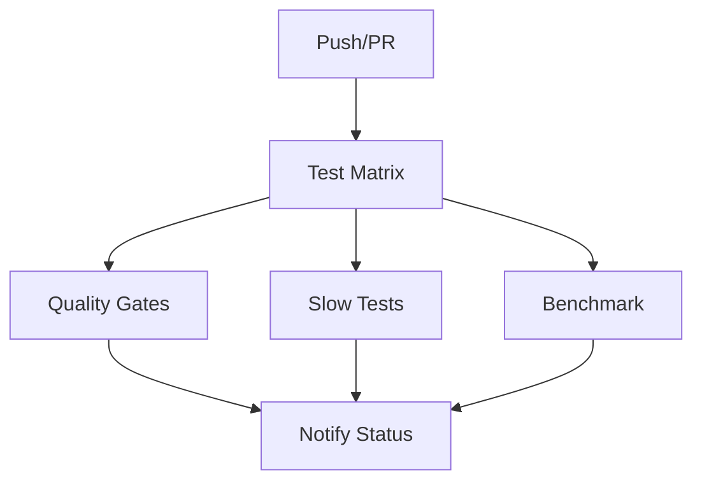

# CI/CD Pipeline Setup Guide

## Overview

The Control Description Analyzer uses GitHub Actions for continuous integration and deployment. The pipeline is designed to ensure code quality, performance, and reliability across multiple Python versions.

## Workflow Structure

### Main Workflow: `test.yml`

The CI/CD pipeline consists of several jobs that run in parallel and sequence:



## Job Breakdown

### 1. Test Job (Matrix Strategy)
**Runs on**: All pushes and pull requests  
**Python versions**: 3.8, 3.9, 3.10, 3.11, 3.12  
**Duration**: ~5-10 minutes per version

**Steps**:
1. **Environment Setup**
   - Checkout code
   - Setup Python version
   - Cache pip dependencies
   - Install system dependencies

2. **Dependency Installation**
   - Install project requirements
   - Install test requirements
   - Download spaCy models

3. **Code Quality Checks**
   - Flake8 linting (syntax errors only)
   - Static analysis warnings

4. **Test Execution**
   - Priority 1 (Critical) tests
   - Priority 2 (Business Logic) tests
   - Priority 3 (Integration) tests
   - Non-slow performance tests

5. **Coverage Reporting**
   - Generate coverage reports (XML, HTML)
   - Enforce 85% minimum coverage
   - Upload to Codecov

6. **Artifact Archival**
   - Test results and coverage reports
   - Performance benchmark data

### 2. Slow Tests Job
**Runs on**: Push to main/develop branches only  
**Python version**: 3.11  
**Duration**: ~10-15 minutes

**Purpose**: Run resource-intensive performance tests (1000+ controls)

### 3. Quality Gates Job
**Runs on**: After main test job completes  
**Python version**: 3.11  
**Duration**: ~3-5 minutes

**Checks**:
- **Coverage**: Minimum 85% line coverage
- **Security**: Safety and Bandit scans
- **Code Quality**: Pylint analysis (7.0+ score)
- **Type Checking**: MyPy validation

### 4. Benchmark Job
**Runs on**: Push to main branch only  
**Python version**: 3.11  
**Duration**: ~2-3 minutes

**Purpose**: Track performance trends over time

### 5. Status Notification Job
**Runs on**: Always (after other jobs)  
**Purpose**: Provide summary and fail pipeline if quality gates not met

## Quality Gates

The pipeline enforces several quality gates that must pass:

| Gate | Threshold | Action on Failure |
|------|-----------|-------------------|
| Test Pass Rate | 100% for P1 tests | ❌ Fail pipeline |
| Code Coverage | ≥ 85% line coverage | ❌ Fail pipeline |
| Performance | All benchmarks pass | ❌ Fail pipeline |
| Security | No critical issues | ⚠️ Warning only |
| Code Quality | Pylint score ≥ 7.0 | ⚠️ Warning only |

## Triggers

### Automatic Triggers
- **Push** to branches: `main`, `develop`, `when_split_test`
- **Pull Request** to: `main`, `develop`

### Manual Triggers
- Workflow can be triggered manually from GitHub Actions tab
- Individual jobs can be re-run if needed

## Branch Strategy

### Main Branch (`main`)
- Full test suite including slow tests
- Performance benchmarking
- Quality gate enforcement
- Deployment-ready builds

### Development Branch (`develop`)
- Full test suite including slow tests
- Quality gate enforcement
- Pre-release validation

### Feature Branches
- Core test suite (fast tests only)
- Quality gate enforcement
- Pull request validation

## Artifacts and Reports

### Generated Artifacts
1. **Test Results** (`test-results-{python-version}`)
   - Coverage reports (XML, HTML)
   - Test execution logs
   - Performance data

2. **Performance Results** (`performance-results-{python-version}`)
   - Benchmark data
   - Performance trends

3. **Quality Reports** (`quality-check-results`)
   - Security scan results
   - Code quality metrics
   - Static analysis reports

4. **Slow Test Results** (`slow-test-results`)
   - Large dataset performance data
   - Memory usage reports

### Report Locations
- **Coverage Reports**: Available in job artifacts and Codecov
- **Performance Data**: Stored in `.benchmarks/` directory
- **Security Reports**: JSON format artifacts
- **Test Summary**: GitHub Actions summary page

## Configuration Files

### Required Files
- `requirements.txt` - Production dependencies
- `requirements-test.txt` - Testing dependencies
- `pytest.ini` - Pytest configuration
- `config/control_analyzer_updated.yaml` - Analyzer configuration

### Environment Setup
The pipeline automatically handles:
- Python environment setup
- Dependency caching for faster builds
- spaCy model downloads
- System dependency installation

## Monitoring and Maintenance

### Performance Monitoring
- Benchmark results tracked over time
- Performance regression detection
- Memory usage validation

### Coverage Tracking
- Line coverage reports per Python version
- Coverage trends over commits
- Missing coverage identification

### Security Monitoring
- Dependency vulnerability scanning
- Code security analysis
- Automated security alerts

## Local Development

To run the same checks locally:

```bash
# Install test dependencies
pip install -r requirements-test.txt

# Run the same test sequence as CI
pytest tests/unit/test_core_analyzer.py tests/unit/test_control_classifier.py -v
pytest tests/unit/test_business_logic.py -v
pytest tests/integration/test_integration_points.py -v
pytest tests/performance/ -v -m "not slow"

# Run with coverage
pytest tests/unit/ tests/integration/ --cov=src --cov-report=html --cov-fail-under=85

# Run quality checks
flake8 . --count --select=E9,F63,F7,F82 --show-source --statistics
pylint src/ --fail-under=7.0
mypy src/ --ignore-missing-imports
bandit -r src/
safety check
```

## Troubleshooting

### Common Issues

1. **Coverage Below 85%**
   - Add tests for uncovered code paths
   - Check for missing test files
   - Verify test execution scope

2. **Performance Test Failures**
   - Check system resources
   - Verify test thresholds are realistic
   - Review performance regression

3. **Security Scan Failures**
   - Update vulnerable dependencies
   - Review code for security issues
   - Add security exceptions if needed

4. **Dependency Installation Failures**
   - Check requirements.txt syntax
   - Verify package availability
   - Review Python version compatibility

### Getting Help

- Check GitHub Actions logs for detailed error messages
- Review artifact downloads for detailed reports
- Compare with previous successful runs
- Check the testing strategy documentation

## Future Enhancements

### Planned Improvements
1. **Parallel Test Execution**: Implement pytest-xdist for faster testing
2. **Docker Integration**: Containerized testing environments
3. **Database Testing**: Integration with test databases
4. **Deployment Automation**: Automated release creation
5. **Performance Regression Detection**: Automated performance alerts

### Metrics Collection
- Test execution time trends
- Coverage improvement tracking
- Performance benchmark history
- Code quality score evolution

---
*Last updated: January 2025*  
*Pipeline version: 1.0*